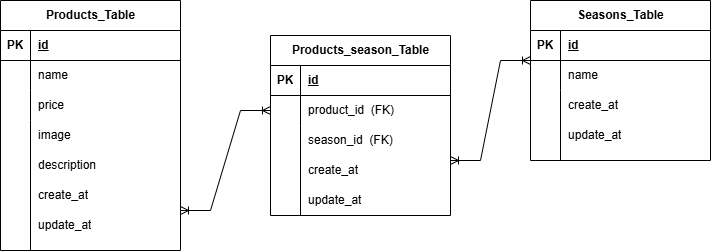

# mogitate

##環境構築
git@github.com:mii4573/mogitate.git
docker-compose up -d --build

##Laravel環境構築
docker-compose exec php bash
composer install
cp .env.example .env 環境変数を適宜変更
php artisan key:generate
php artisan migrate
php artisan db:seed

##使用技術
php 8.1-fpm
Laravel 8.83.29
MySQL 8.0.26
nginx 1.21.1

##開発環境
商品一覧画面:http://localhost
phpMyAdmin:http://localhost:8080

